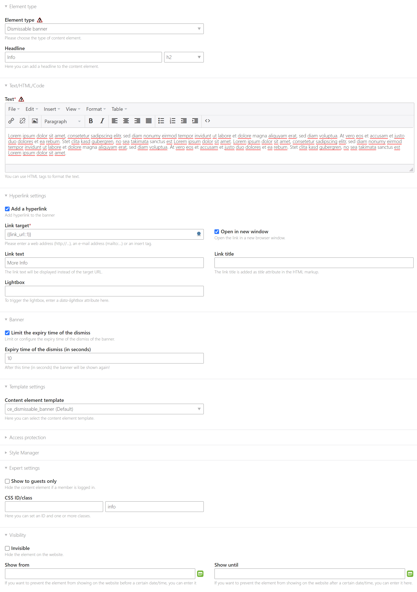

# Dismissable Banner Element for Contao Open Source CMS

This Bundle provides a dismissable banner content element. The dismiss of the banner is stored in the local storage of the browser.
The banner will also be shown again after the configured expiry time (default: 30 days) or if it has been modified in the back end since the dismiss of the user.

## Installation

Install the bundle via Composer:

```
composer require bwein-net/contao-dismissable-banner-element
```

## Configuration

After the installation you can add and configure new content elements "Dismissable banner" to the articles.
You can fill a headline, text, optional link and expiry time of the dismiss for the local storage (default: 30 days).


You can even set some css classes of the included styling for the banner: `success, danger, warning, info`

## Styling

You can override the template [`ce_dismissable_banner.html5`](contao/templates/ce_dismissable_banner.html5) and remove the lines for the included stylesheets or you can extend the template and add the following lines to your new template:
```php
// templates/ce_dismissable_banner_nocss.html5
<?php $this->extend('ce_dismissable_banner'); ?>
<?php $this->noCss = true; ?>
```
**Caution: If your remove the `data` attributes of the enclosing container or the Javascript asset, the extension will stop working!**

## Screenshots

### Back end



### Front end


## Sponsors

This Extension was commissioned and financed by https://www.medienflieger.de/
